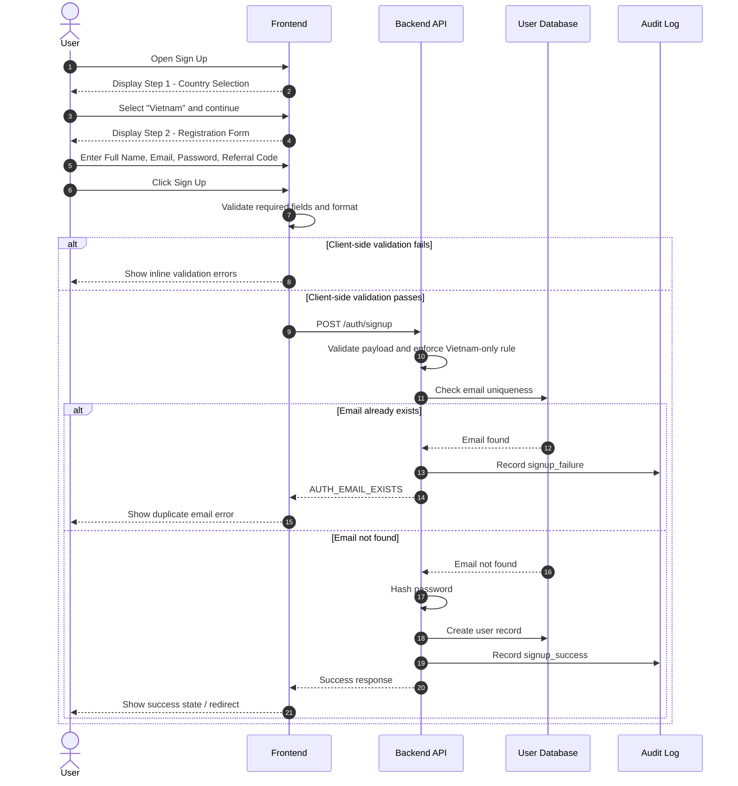
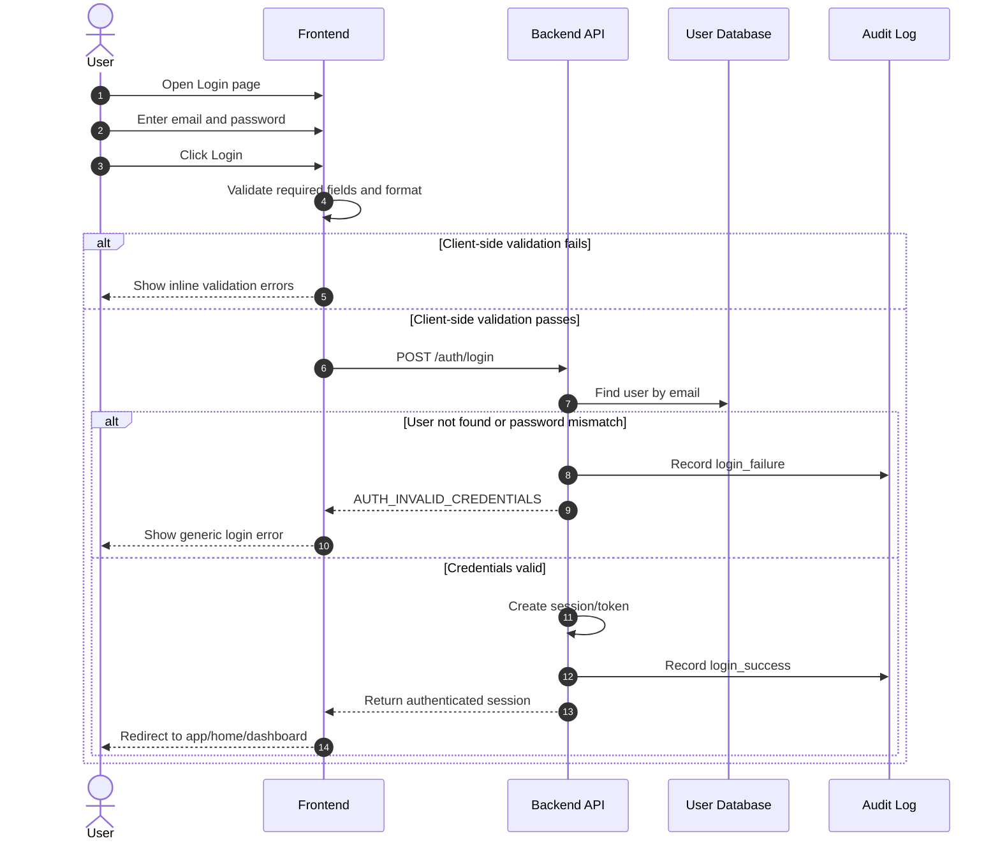

# FRS-AUTH-01: Sign Up and Login Flow

Role: Business Analyst
Type: FRS

1. Document Control

| Field | Value |
| --- | --- |
| Project Name | Ryan Exchange |
| Document Title | Functional Requirements Specification – Sign Up and Login Flow |
| Document ID | FRS-AUTH-01 |
| Version | v1.0 |
| Status | Draft |
| Author | Business Analysis Draft |
| Language | English |
| Primary Owner | Khoa Do - Owner/Product Manager |
| Stakeholders | Subagent - Quality Assurance
Subagent - Business Analyst
Subagent - Front-End Developer
Subagent - Back-End Developer
Subagent - System Artchitechture |

---

## 2. Purpose of the Document

This document defines the functional and non-functional requirements for the Sign Up and Login flow of Ryan Exchange based on the approved wireframe. Its purpose is to translate the UI concept into a business and system specification that can be consumed consistently by Frontend, Backend, and QA teams. The document focuses on the first production-ready version of authentication entry points and intentionally limits the scope to a simple and controlled onboarding flow.

At this stage, the registration flow supports only one country selection, which is Vietnam. The design already implies a future multi-country onboarding model, but all current logic, validations, and backend behavior must enforce Vietnam-only onboarding until additional jurisdictions are officially enabled.

This document also clarifies ownership, screen behavior, validation rules, business rules, API expectations, error handling, and testable acceptance criteria so that downstream implementation does not rely on assumptions.

---

## 3. Business Context

Ryan Exchange is positioning itself as a next-generation crypto trading platform with a premium and security-oriented onboarding experience. The authentication module is the first touchpoint for new and returning users, so it must balance clarity, trust, conversion efficiency, and operational control.

The wireframe shows a two-step Sign Up process and a direct Login flow. The Sign Up flow is intentionally simplified to reduce friction while preserving basic data capture required for account creation. The Login flow is email-and-password based, with placeholders for future Single Sign-On options that are visible in UI but not active in the current release.

The key business goal of this module is to allow users to create and access accounts successfully while ensuring the platform retains control over country availability, data quality, and future extensibility.

---

## 4. Scope

### 4.1 In Scope

The first release includes the following functions:

- Two-step Sign Up flow
- Step 1: Country/Region selection
- Step 2: Registration form
- Login using email and password
- Display of SSO login options as unavailable or inactive
- Basic validation for all visible input fields
- Account creation for Vietnam users only
- Secure credential submission from UI to backend
- Error and success messaging
- Audit logging of major authentication events

### 4.2 Out of Scope

The following items are not included in this release and should not be assumed by development teams:

- Multi-country registration enablement
- OTP verification
- Email verification flow
- Phone number registration
- QR login
- Biometric login
- Active SSO providers such as Google or Apple
- Forgot password flow implementation
- KYC flow after registration
- MFA/2FA setup
- Account lockout and fraud engine beyond basic login protection
- Admin portal authentication management

---

## 5. Stakeholder and Role Definition

| Name | Role Title | System/Project Role | Responsibility in This Module |
| --- | --- | --- | --- |
| Toan Vo | CTO | Owner | Final technical owner of architecture, implementation logic, security decisions, and production readiness |
| Dinh Tran | CEO | Admin | Executive stakeholder with business oversight |
| Khoa Do | Product Manager | Non-signing Admin | Defines business logic, flow requirements, UX intent, and acceptance expectations |
| Linh Tran | Project Manager | Non-signing Admin | Coordinates delivery progress, cross-team alignment, and timeline execution |

The roles above are project governance roles for delivery ownership. They are not end-user system roles inside the Ryan Exchange product. The actual end-user role in this document is the public user who wants to create an account or log in.

---

## 6. User Persona and Primary Use Cases

### 6.1 Primary Persona

The primary persona is a retail user who wants to create a Ryan Exchange account quickly and begin using the platform. The user may be unfamiliar with platform-specific onboarding rules, so the flow must be self-explanatory and low-friction.

### 6.2 Core Use Cases

| Use Case ID | Use Case Name | Description |
| --- | --- | --- |
| UC-01 | Select country before registration | User selects operating country as the first onboarding step |
| UC-02 | Register account | User submits full name, email, password, and optional referral code |
| UC-03 | Log in with email and password | Returning user accesses account |
| UC-04 | Attempt unsupported SSO | User clicks a visible SSO option that is not yet available |
| UC-05 | Encounter validation or backend failure | User receives error feedback and can correct input |

---

## 7. High-Level User Flow

The authentication experience is divided into two major entry journeys.

The Sign Up flow starts with country selection. In the first release, the only selectable option is Vietnam. Once Vietnam is selected, the user proceeds to the account registration form. The user then provides full name, email address, password, and an optional referral code. After validation passes and the backend successfully creates the account, the system either signs the user in directly or redirects the user to the next onboarding stage, depending on implementation choice. Since post-sign-up destination has not yet been defined, this document assumes successful registration leads to a “registration success” state and then redirects to Login or the authenticated homepage based on product decision.

The Login flow is simpler. The user enters email and password, submits the form, and receives either successful authentication or an error. SSO options may be displayed for design consistency, but they must remain disabled or explicitly marked unavailable.

---

## 8. Screen-Level Functional Breakdown

## 8.1 Sign Up – Step 1/2: Country Selection

The first Sign Up screen requires the user to choose their country or region of residence. In the current release, the only valid option is Vietnam. Although the component visually supports a dropdown, backend and frontend must both enforce Vietnam-only registration.

### UI Elements

| Field | Type | Required | Editable | Current Behavior |
| --- | --- | --- | --- | --- |
| Country/Region | Dropdown | Yes | Yes | Only “Vietnam” is available |
| Continue / Create Account CTA | Button | Yes | No | Enabled only after valid country selection |
| Terms/Policy text | Static text | No | No | Display only |

### Business Intent

This step serves as a regulatory and business gate. Even though the current scope is narrow, the structure is intentionally future-proofed for later expansion into multiple countries. The selected value should be stored as part of onboarding context and passed to the backend during registration.

### Functional Rules

- The country selection is mandatory.
- The only available option in v1.0 is `Vietnam`.
- If the user somehow attempts to continue with any value other than `Vietnam`, the system must block progress.
- The system should persist the selected country through Step 2 within the same session.

---

## 8.2 Sign Up – Step 2/2: Registration Form

Once the user passes the country selection step, the registration form is displayed.

### UI Elements

| Field | Type | Required | Validation Summary |
| --- | --- | --- | --- |
| Full Name | Text input | Yes | Cannot be empty; must meet name format rules |
| Email Address | Email input | Yes | Must follow valid email format and uniqueness rules |
| Password | Password input | Yes | Must meet password policy |
| Referral Code | Text input | No | Optional; validate format only if provided |
| Continue CTA | Button | Yes | Enabled only when required fields pass validation |

### Functional Description

The purpose of this step is to collect the minimum set of data required to create a user account. The screen must show clear field labels and validation feedback. Empty or malformed input must be caught before submission where possible. Backend validation remains the final source of truth and must never rely solely on client-side checks.

---

## 8.3 Login Screen

The Login screen is used by returning users.

### UI Elements

| Field | Type | Required | Validation Summary |
| --- | --- | --- | --- |
| Email | Email input | Yes | Must follow valid email format |
| Password | Password input | Yes | Cannot be empty |
| Remember me | Checkbox | Optional | Stores session preference if implemented |
| Forgot Password | Link | Visible | Not in scope for current release unless separately implemented |
| Continue CTA | Button | Yes | Enabled when required fields are present |
| SSO Options | Buttons | Visible | Disabled or marked unavailable |

### Functional Description

The Login flow authenticates a previously registered user using email and password. The system must protect against invalid credentials and provide meaningful but safe error feedback. Error messages must not reveal whether the email or password was specifically incorrect.

---

## 9. Detailed Functional Requirements

## 9.1 Sign Up Requirements

| Req ID | Requirement |
| --- | --- |
| FR-SU-001 | The system shall display a two-step Sign Up flow. |
| FR-SU-002 | The system shall require country/region selection before displaying the registration form. |
| FR-SU-003 | The system shall support only `Vietnam` as an eligible country in v1.0. |
| FR-SU-004 | The system shall prevent the user from continuing if no country is selected. |
| FR-SU-005 | The system shall display a registration form containing Full Name, Email Address, Password, and optional Referral Code. |
| FR-SU-006 | The system shall validate required fields before allowing submission. |
| FR-SU-007 | The system shall validate email format on both frontend and backend. |
| FR-SU-008 | The system shall validate password against the configured password policy. |
| FR-SU-009 | The system shall treat referral code as optional. |
| FR-SU-010 | The system shall create a new account only if the email does not already exist. |
| FR-SU-011 | The system shall associate the selected country with the newly created user account or onboarding profile. |
| FR-SU-012 | The system shall log account creation attempts and outcomes for audit purposes. |

## 9.2 Login Requirements

| Req ID | Requirement |
| --- | --- |
| FR-LI-001 | The system shall allow login using email and password. |
| FR-LI-002 | The system shall validate the presence of both email and password before submission. |
| FR-LI-003 | The system shall reject invalid credentials with a generic error message. |
| FR-LI-004 | The system shall create an authenticated session upon successful login. |
| FR-LI-005 | The system shall display SSO login options as unavailable or inactive in v1.0. |
| FR-LI-006 | The system shall log login attempts and outcomes for audit purposes. |
| FR-LI-007 | The system shall handle repeated failed attempts according to security policy if such policy is later enabled. In v1.0, this is tracked but may not yet trigger lockout. |

---

## 10. Business Rules

| Rule ID | Business Rule |
| --- | --- |
| BR-001 | Only users who select Vietnam may proceed through Sign Up in v1.0. |
| BR-002 | A user account is uniquely identified by email address. Duplicate email registration is not allowed. |
| BR-003 | Referral code is optional and must not block registration when empty. |
| BR-004 | SSO login options may be visible in the interface for future readiness but must not be operational in v1.0. |
| BR-005 | The system must not expose sensitive details in authentication error messages. |
| BR-006 | Frontend validation improves user experience, but backend validation remains authoritative. |
| BR-007 | Country selection made in Step 1 must persist until registration submission is completed or the session is reset. |
| BR-008 | Authentication events must be captured in audit logs with timestamp, event type, and status. |

---

## 11. Validation Rules

## 11.1 Sign Up Field Validation

| Field | Rule |
| --- | --- |
| Full Name | Required; trimmed value cannot be empty; minimum 2 characters; maximum 100 characters; alphabetic and common punctuation allowed |
| Email Address | Required; valid email format; maximum 254 characters; must be unique in system |
| Password | Required; minimum 8 characters; maximum 64 characters; must contain at least one uppercase letter, one lowercase letter, one number, and one special character |
| Referral Code | Optional; if entered, maximum 50 characters; alphanumeric only unless business later defines another format |
| Country/Region | Required; must equal `Vietnam` in v1.0 |

## 11.2 Login Field Validation

| Field | Rule |
| --- | --- |
| Email | Required; valid email format |
| Password | Required; cannot be empty |

---

## 12. Error Handling and User Messaging

Authentication flows must provide immediate, understandable, and safe feedback. Messaging should guide correction without disclosing internal logic or security-sensitive details.

| Scenario | User Message |
| --- | --- |
| No country selected | Please select your country or region to continue. |
| Unsupported country submitted | Registration is currently available only for Vietnam. |
| Full Name empty | Please enter your full name. |
| Invalid email format | Please enter a valid email address. |
| Email already exists | Email already existed, please use another email |
| Weak password | Your password does not meet the security requirements. |
| Invalid referral code format | Referral code format is invalid. |
| Login with wrong credentials | Invalid email or password. |
| Backend unavailable | Something went wrong. Please try again later. |
| SSO clicked while unavailable | This login method is not available yet. |

---

## 13. Frontend Behavior Notes

The frontend must implement the authentication flow exactly as a staged journey and must not collapse Sign Up Step 1 and Step 2 into a single screen unless formally approved by Product. The step indicator, CTA state, inline validation, field labels, placeholder behavior, and disabled states must follow the wireframe intent.

The SSO buttons shown in the design must be implemented as inactive or placeholder controls. They must not initiate any provider flow, redirect, or hidden API call in v1.0.

The frontend should preserve the selected country while the user is on the Sign Up path. If the user refreshes the page, the behavior may either reset the flow or restore state from session storage, depending on FE implementation decision. This should be aligned during implementation grooming.

---

## 14. Backend Expectations

The backend is responsible for enforcing all authoritative rules related to registration and login. It must not trust client-supplied state blindly, especially for country restriction, email uniqueness, password compliance, and credential validation.

### Expected Backend Responsibilities

- Validate request payload structure
- Enforce Vietnam-only registration in v1.0
- Check email uniqueness during Sign Up
- Hash password securely before persistence
- Authenticate email/password during Login
- Return appropriate success and failure response codes
- Generate user record and authentication session/token
- Record audit logs for attempts and outcomes

---

## 15. Suggested API Contract

The exact API design may vary by backend framework, but the following contract is recommended for alignment.

## 15.1 Sign Up

**Endpoint**

`POST /api/v1/auth/signup`

**Request Example**

```json
{
  "country": "Vietnam",
  "fullName": "Nguyen Van A",
  "email": "user@example.com",
  "password": "StrongPass@123",
  "referralCode": "RYAN2026"
}
```

**Success Response Example**

```json
{
  "success": true,
  "message": "Account created successfully.",
  "data": {
    "userId": "usr_001",
    "email": "user@example.com",
    "country": "Vietnam"
  }
}
```

**Error Response Example**

```json
{
  "success": false,
  "message": "Email already existed, please use another email",
  "errorCode": "AUTH_EMAIL_EXISTS"
}
```

## 15.2 Login

**Endpoint**

`POST /api/v1/auth/login`

**Request Example**

```json
{
  "email": "user@example.com",
  "password": "StrongPass@123"
}
```

**Success Response Example**

```json
{
  "success": true,
  "message": "Login successful.",
  "data": {
    "accessToken": "jwt-or-session-token",
    "refreshToken": "refresh-token-if-applicable",
    "user": {
      "userId": "usr_001",
      "email": "user@example.com"
    }
  }
}
```

**Error Response Example**

```json
{
  "success": false,
  "message": "Invalid email or password.",
  "errorCode": "AUTH_INVALID_CREDENTIALS"
}
```

---

## 16. Data Model – Minimum Fields

| Field | Type | Required | Notes |
| --- | --- | --- | --- |
| user_id | String/UUID | Yes | System-generated unique identifier |
| full_name | String | Yes | Captured during Sign Up |
| email | String | Yes | Unique |
| password_hash | String | Yes | Never store raw password |
| country | String | Yes | `Vietnam` in v1.0 |
| referral_code | String | No | Optional user input |
| created_at | Datetime | Yes | Audit and sorting |
| updated_at | Datetime | Yes | Record maintenance |
| last_login_at | Datetime | No | Updated after successful login |
| account_status | Enum | Yes | Suggested values: active, pending, disabled |

---

## 17. Audit Log Requirements

Authentication is a security-sensitive module and must produce traceable records.

| Event Type | Description | Minimum Fields |
| --- | --- | --- |
| signup_attempt | User submits registration form | timestamp, email, country, result |
| signup_success | Account successfully created | timestamp, user_id, email |
| signup_failure | Registration rejected | timestamp, email, error_code |
| login_attempt | User submits login form | timestamp, email, result |
| login_success | Authentication successful | timestamp, user_id, email |
| login_failure | Authentication rejected | timestamp, email, error_code |
| sso_click_unavailable | User clicks unavailable SSO option | timestamp, provider_label |

---

## 18. Non-Functional Requirements

| NFR ID | Requirement |
| --- | --- |
| NFR-001 | Passwords must be hashed using an industry-standard secure hashing method. |
| NFR-002 | All authentication requests must be transmitted over HTTPS only. |
| NFR-003 | The UI should return inline validation feedback within acceptable user interaction timing. |
| NFR-004 | The system should respond to authentication API requests within acceptable application SLA under normal load. |
| NFR-005 | Error messaging must not disclose security-sensitive system details. |
| NFR-006 | The module should be designed to support future country expansion without major frontend redesign. |
| NFR-007 | The module should be designed to support future email verification, MFA, and SSO activation. |

---

## 19. Acceptance Criteria

## 19.1 Sign Up

| AC ID | Acceptance Criteria |
| --- | --- |
| AC-SU-001 | Given the user opens Sign Up, when no country is selected, then the user cannot continue to Step 2. |
| AC-SU-002 | Given the user selects Vietnam, when the user clicks continue, then the registration form is displayed. |
| AC-SU-003 | Given the user leaves Full Name empty, when submitting the form, then the system shows a validation message and blocks submission. |
| AC-SU-004 | Given the user enters an invalid email, when submitting the form, then the system shows a validation message and blocks submission. |
| AC-SU-005 | Given the user enters a weak password, when submitting the form, then the system shows a validation message and blocks submission. |
| AC-SU-006 | Given the user enters an already registered email, when submitting the form, then the backend rejects the request and the UI displays the correct error message. |
| AC-SU-007 | Given the user enters a valid referral code, when submitting the form, then registration succeeds if all other fields are valid. |
| AC-SU-008 | Given the user leaves referral code blank, when submitting the form, then registration still succeeds if all required fields are valid. |
| AC-SU-009 | Given the request payload contains a country other than Vietnam, when processed by backend, then account creation is rejected. |

## 19.2 Login

| AC ID | Acceptance Criteria |
| --- | --- |
| AC-LI-001 | Given the user enters valid email and password, when clicking login, then the system authenticates the user successfully. |
| AC-LI-002 | Given the user enters invalid credentials, when clicking login, then the system displays a generic invalid credentials message. |
| AC-LI-003 | Given the user leaves required fields empty, when clicking login, then the system blocks submission and shows validation messages. |
| AC-LI-004 | Given the user clicks an SSO option in v1.0, when the option is unavailable, then the system displays an unavailable message and does not proceed further. |

---

## 20. QA Test Focus Areas

QA should prioritize the following dimensions:

- Positive path registration for Vietnam
- Negative path registration for invalid inputs
- Duplicate email behavior
- Session and redirect behavior after successful Sign Up
- Successful and failed login paths
- SSO placeholder click handling
- UI state consistency between steps
- API error handling and message mapping
- Audit log generation for all major events
- Country restriction enforcement on both FE and BE

---

## 21. Sequence Diagram – Sign Up



---

## 22. Sequence Diagram – Login



---

## 23. BPMN-Style Flow – Draw.io XML

Phần dưới đây là bản **draw.io XML** ở mức đơn giản để team có thể paste trực tiếp vào draw.io qua **File → Import From → Device** hoặc copy vào file `.drawio`.

```xml
<mxfile host="app.diagrams.net">
  <diagram name="Ryan Exchange - Sign Up Login Flow">
    <mxGraphModel dx="1200" dy="800" grid="1" gridSize="10" guides="1" tooltips="1" connect="1" arrows="1" fold="1" page="1" pageScale="1" pageWidth="1600" pageHeight="900" math="0" shadow="0">
      <root>
        <mxCell id="0"/>
        <mxCell id="1" parent="0"/>

        <mxCell id="start1" value="Start" style="ellipse;whiteSpace=wrap;html=1;" vertex="1" parent="1">
          <mxGeometry x="60" y="120" width="80" height="40" as="geometry"/>
        </mxCell>

        <mxCell id="signup1" value="Open Sign Up" style="rounded=1;whiteSpace=wrap;html=1;" vertex="1" parent="1">
          <mxGeometry x="180" y="120" width="140" height="50" as="geometry"/>
        </mxCell>

        <mxCell id="country" value="Select Country/Region" style="rounded=1;whiteSpace=wrap;html=1;" vertex="1" parent="1">
          <mxGeometry x="360" y="120" width="180" height="50" as="geometry"/>
        </mxCell>

        <mxCell id="countryCheck" value="Country = Vietnam?" style="rhombus;whiteSpace=wrap;html=1;" vertex="1" parent="1">
          <mxGeometry x="580" y="115" width="120" height="60" as="geometry"/>
        </mxCell>

        <mxCell id="rejectCountry" value="Show 'Vietnam only' error" style="rounded=1;whiteSpace=wrap;html=1;fillColor=#f8cecc;strokeColor=#b85450;" vertex="1" parent="1">
          <mxGeometry x="750" y="40" width="190" height="60" as="geometry"/>
        </mxCell>

        <mxCell id="form" value="Display Registration Form" style="rounded=1;whiteSpace=wrap;html=1;" vertex="1" parent="1">
          <mxGeometry x="750" y="150" width="190" height="60" as="geometry"/>
        </mxCell>

        <mxCell id="submitSignup" value="Submit Sign Up Data" style="rounded=1;whiteSpace=wrap;html=1;" vertex="1" parent="1">
          <mxGeometry x="980" y="150" width="170" height="60" as="geometry"/>
        </mxCell>

        <mxCell id="validateSignup" value="Validate Inputs &amp; Check Email" style="rhombus;whiteSpace=wrap;html=1;" vertex="1" parent="1">
          <mxGeometry x="1190" y="145" width="150" height="70" as="geometry"/>
        </mxCell>

        <mxCell id="signupFail" value="Show Validation / Duplicate Email Error" style="rounded=1;whiteSpace=wrap;html=1;fillColor=#f8cecc;strokeColor=#b85450;" vertex="1" parent="1">
          <mxGeometry x="1390" y="70" width="220" height="60" as="geometry"/>
        </mxCell>

        <mxCell id="signupSuccess" value="Create Account Successfully" style="rounded=1;whiteSpace=wrap;html=1;fillColor=#d5e8d4;strokeColor=#82b366;" vertex="1" parent="1">
          <mxGeometry x="1390" y="170" width="220" height="60" as="geometry"/>
        </mxCell>

        <mxCell id="loginStart" value="Open Login" style="rounded=1;whiteSpace=wrap;html=1;" vertex="1" parent="1">
          <mxGeometry x="180" y="320" width="140" height="50" as="geometry"/>
        </mxCell>

        <mxCell id="loginForm" value="Enter Email + Password" style="rounded=1;whiteSpace=wrap;html=1;" vertex="1" parent="1">
          <mxGeometry x="360" y="320" width="180" height="50" as="geometry"/>
        </mxCell>

        <mxCell id="submitLogin" value="Submit Login" style="rounded=1;whiteSpace=wrap;html=1;" vertex="1" parent="1">
          <mxGeometry x="580" y="320" width="140" height="50" as="geometry"/>
        </mxCell>

        <mxCell id="validateLogin" value="Credentials Valid?" style="rhombus;whiteSpace=wrap;html=1;" vertex="1" parent="1">
          <mxGeometry x="760" y="315" width="140" height="60" as="geometry"/>
        </mxCell>

        <mxCell id="loginFail" value="Show Invalid Credentials Error" style="rounded=1;whiteSpace=wrap;html=1;fillColor=#f8cecc;strokeColor=#b85450;" vertex="1" parent="1">
          <mxGeometry x="950" y="260" width="210" height="60" as="geometry"/>
        </mxCell>

        <mxCell id="loginSuccess" value="Login Success / Create Session" style="rounded=1;whiteSpace=wrap;html=1;fillColor=#d5e8d4;strokeColor=#82b366;" vertex="1" parent="1">
          <mxGeometry x="950" y="350" width="210" height="60" as="geometry"/>
        </mxCell>

        <mxCell id="end" value="End" style="ellipse;whiteSpace=wrap;html=1;" vertex="1" parent="1">
          <mxGeometry x="1210" y="350" width="80" height="40" as="geometry"/>
        </mxCell>

        <mxCell id="e1" style="edgeStyle=orthogonalEdgeStyle;rounded=0;orthogonalLoop=1;jettySize=auto;html=1;endArrow=block;" edge="1" parent="1" source="start1" target="signup1">
          <mxGeometry relative="1" as="geometry"/>
        </mxCell>
        <mxCell id="e2" style="edgeStyle=orthogonalEdgeStyle;html=1;endArrow=block;" edge="1" parent="1" source="signup1" target="country">
          <mxGeometry relative="1" as="geometry"/>
        </mxCell>
        <mxCell id="e3" style="edgeStyle=orthogonalEdgeStyle;html=1;endArrow=block;" edge="1" parent="1" source="country" target="countryCheck">
          <mxGeometry relative="1" as="geometry"/>
        </mxCell>
        <mxCell id="e4" value="No" style="edgeStyle=orthogonalEdgeStyle;html=1;endArrow=block;" edge="1" parent="1" source="countryCheck" target="rejectCountry">
          <mxGeometry relative="1" as="geometry"/>
        </mxCell>
        <mxCell id="e5" value="Yes" style="edgeStyle=orthogonalEdgeStyle;html=1;endArrow=block;" edge="1" parent="1" source="countryCheck" target="form">
          <mxGeometry relative="1" as="geometry"/>
        </mxCell>
        <mxCell id="e6" style="edgeStyle=orthogonalEdgeStyle;html=1;endArrow=block;" edge="1" parent="1" source="form" target="submitSignup">
          <mxGeometry relative="1" as="geometry"/>
        </mxCell>
        <mxCell id="e7" style="edgeStyle=orthogonalEdgeStyle;html=1;endArrow=block;" edge="1" parent="1" source="submitSignup" target="validateSignup">
          <mxGeometry relative="1" as="geometry"/>
        </mxCell>
        <mxCell id="e8" value="Fail" style="edgeStyle=orthogonalEdgeStyle;html=1;endArrow=block;" edge="1" parent="1" source="validateSignup" target="signupFail">
          <mxGeometry relative="1" as="geometry"/>
        </mxCell>
        <mxCell id="e9" value="Pass" style="edgeStyle=orthogonalEdgeStyle;html=1;endArrow=block;" edge="1" parent="1" source="validateSignup" target="signupSuccess">
          <mxGeometry relative="1" as="geometry"/>
        </mxCell>

        <mxCell id="e10" style="edgeStyle=orthogonalEdgeStyle;html=1;endArrow=block;" edge="1" parent="1" source="start1" target="loginStart">
          <mxGeometry relative="1" as="geometry"/>
        </mxCell>
        <mxCell id="e11" style="edgeStyle=orthogonalEdgeStyle;html=1;endArrow=block;" edge="1" parent="1" source="loginStart" target="loginForm">
          <mxGeometry relative="1" as="geometry"/>
        </mxCell>
        <mxCell id="e12" style="edgeStyle=orthogonalEdgeStyle;html=1;endArrow=block;" edge="1" parent="1" source="loginForm" target="submitLogin">
          <mxGeometry relative="1" as="geometry"/>
        </mxCell>
        <mxCell id="e13" style="edgeStyle=orthogonalEdgeStyle;html=1;endArrow=block;" edge="1" parent="1" source="submitLogin" target="validateLogin">
          <mxGeometry relative="1" as="geometry"/>
        </mxCell>
        <mxCell id="e14" value="No" style="edgeStyle=orthogonalEdgeStyle;html=1;endArrow=block;" edge="1" parent="1" source="validateLogin" target="loginFail">
          <mxGeometry relative="1" as="geometry"/>
        </mxCell>
        <mxCell id="e15" value="Yes" style="edgeStyle=orthogonalEdgeStyle;html=1;endArrow=block;" edge="1" parent="1" source="validateLogin" target="loginSuccess">
          <mxGeometry relative="1" as="geometry"/>
        </mxCell>
        <mxCell id="e16" style="edgeStyle=orthogonalEdgeStyle;html=1;endArrow=block;" edge="1" parent="1" source="loginSuccess" target="end">
          <mxGeometry relative="1" as="geometry"/>
        </mxCell>
      </root>
    </mxGraphModel>
  </diagram>
</mxfile>
```

---

## 24. Open Questions for Product Confirmation

Một vài điểm hiện vẫn chưa được define hoàn toàn trong input ban đầu, nên cần Product chốt trước khi FE/BE build production logic:

| Open Item | Current Assumption | Decision Needed |
| --- | --- | --- |
| Post-Sign-Up destination | Success state then redirect | Redirect to Login or auto-login? |
| Password rules | Standard strong password policy | Confirm exact policy |
| Email verification | Not in scope | Confirm whether deferred to later phase |
| Forgot Password | UI may exist but not functional | Hide or leave visible as placeholder |
| Referral code behavior | Stored only | Does it need owner mapping or reward logic now? |
| Remember me | Optional UI behavior | Confirm whether session persistence is required in v1.0 |
| SSO buttons | Visible but unavailable | Should they be disabled, hidden, or show “Coming soon”? |

---

# Notion Sync Summary

## Business Summary

Ryan Exchange’s authentication module consists of a two-step Sign Up flow and a direct Login flow. In the first release, Sign Up is restricted to users selecting Vietnam as their country. Registration requires full name, email, and password, while referral code is optional. Login supports email and password only. SSO options are visible in the wireframe but not active yet.

## Data Structure

The minimum user data includes user ID, full name, email, password hash, country, optional referral code, timestamps, and account status. Email must be unique. Country must be Vietnam in v1.0.

## System Flow

The Sign Up journey begins with country selection, continues to the registration form, passes frontend validation, then backend validation, then account creation. The Login journey validates credentials and creates an authenticated session. All major events should be captured in audit logs.

## Technical Concepts Learned

Frontend validation improves UX but backend validation is the final authority. SSO placeholders can exist in UI without being active in business logic. Country gating is both a UX decision and a backend business rule. Audit logging for authentication events is important for traceability and future security operations.

---

Bước tiếp theo hợp lý nhất là tôi viết tiếp cho bạn **bản Jira-ready breakdown** của tài liệu này theo 4 phần riêng: **FE ticket, BE ticket, QA test case, và API contract summary** để team đem vào sprint planning luôn.
